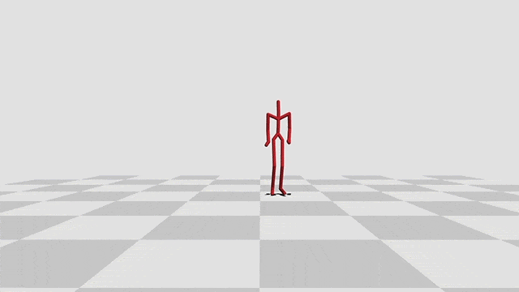

# bvh11

[](https://travis-ci.com/yuki-koyama/bvh11)


A tiny C++11 library for reading (and writing) BVH motion capture data.



## Dependencies

- C++11 standard library
- Eigen 3 <http://eigen.tuxfamily.org/> (`brew install eigen`)

### Additional Dependencies for Demos (Optional)

- three-dim-util <https://github.com/yuki-koyama/three-dim-util/>
  - Eigen 3 (`brew install eigen`)
  - Qt 5 (`brew install qt`)
  - GLM (`brew install glm`)

## Usage

### Build and Install

```bash
git clone https://github.com/yuki-koyama/bvh11.git --recursive
mkdir build
cd build
cmake ../bvh11
make
make install
```

### Import BVH

```cpp
#include <bvh11.hpp>

int main()
{
  bvh11::BvhObject("/path/to/bvh/data.bvh");

  // Do something

  return 0;
}
```

## License

MIT License.

## Contributing

Contributions are welcome.
